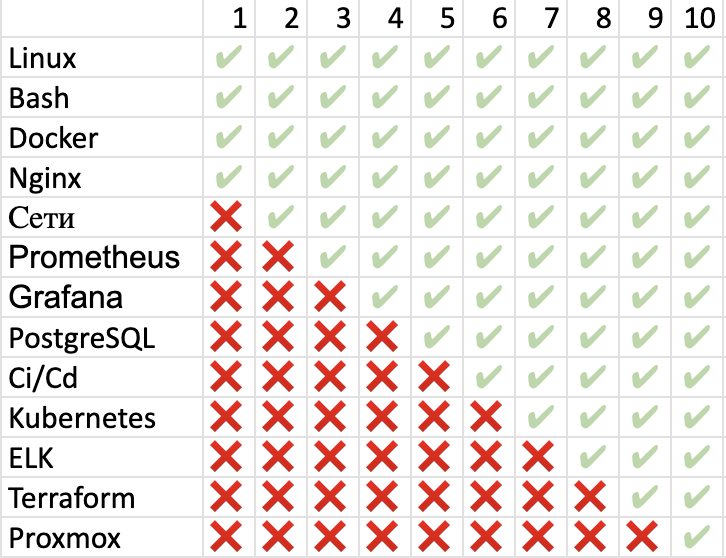
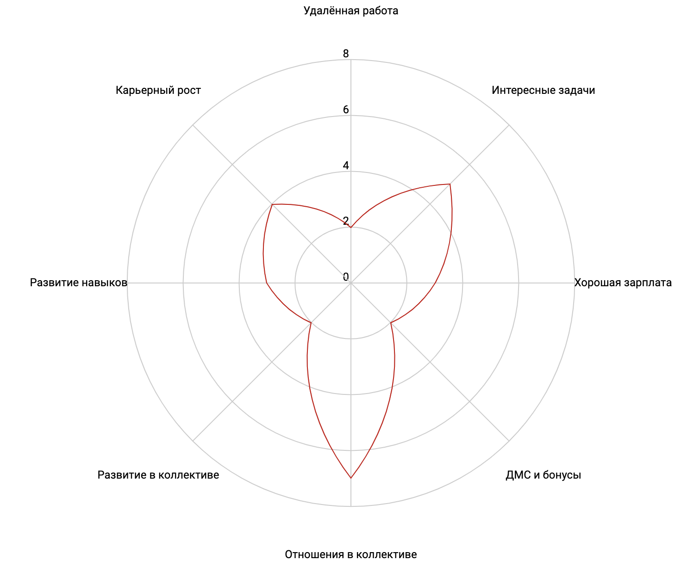
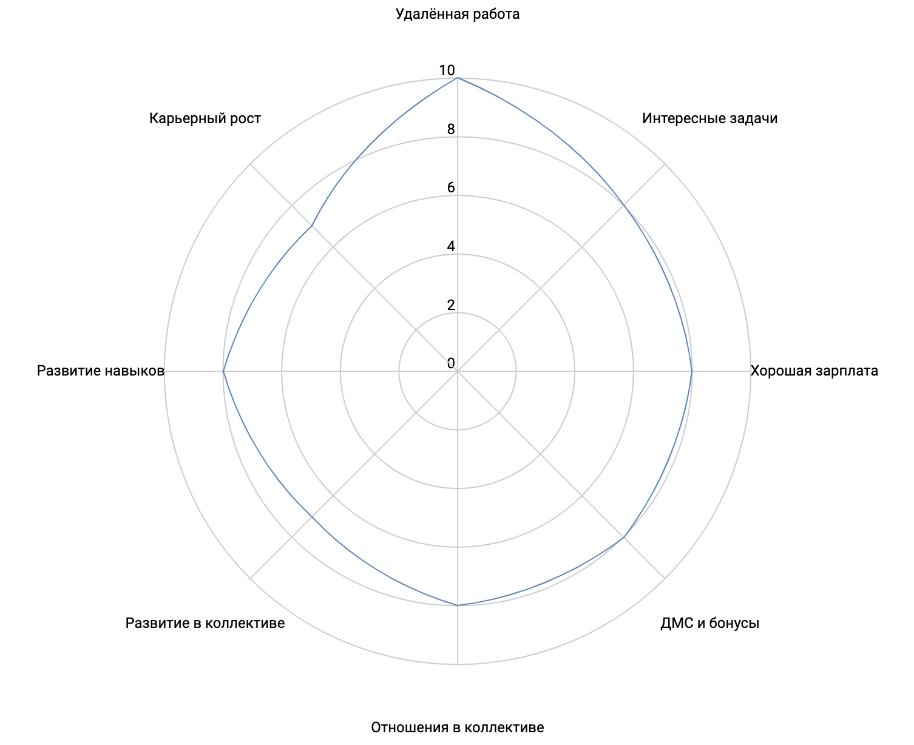

### Критерии выбора работы

- удалённая работа
- интересные задачи
- хорошая зарплата
- ДМС и бонусы
- отношения в коллективе
- развитие в коллективе
- развитие навыков
- карьерный рост

#### Пояснения к критериям

Удалённая работа:
- 10: полностью удалённая работа
- 9: удалённая работа и командировки
- 8: удалённая работа и редкие ночные дежурства
- 7: удалённая работа и ночные дежурства
- 6: гибрид 1 день в неделю офис
- 5: гибрид 2 дня в неделю офис
- 4: гибрид 3 дня в неделю офис
- 3: офис 4 дня в неделю
- 2: офис 5 дней в неделю
- 1: офис 6 дней в неделю

Интересные задачи:

Xорошая зарплата:
- 10: 450-500
- 9: 400-450
- 8: 350-400
- 7: 300-350
- 6: 250-300
- 5: 200-250
- 4: 150-200
- 3: 100-150
- 2: 50-100
- 1: 0-50

ДМС и бонусы:
- 10: 90-100
- 9: 80-90
- 8: 70-80
- 7: 60-70
- 6: 50-60
- 5: 40-50
- 4: 30-40
- 3: 20-30
- 2: 10-20
- 1: 5-10

Развитие в коллективе:
1 - нет развития; 5 - самообразование; 10 - наставничество

Развитие навыков:
1 - нет развития; 5 - средний темп прокачки скиллов как на других работах; 10 - быстрое ознакомление со множеством технологий

Карьерный рост:
1 - нет роста; 5 - новый грейд раз в полгода; 10 - новый грейд раз в два месяца

## Текущее состояние

## Через 2 года

## Шаги для достижения цели:

Удалённая работа:
- найти вакансию с удалённой работой, соответствующей моим критериям
Интересные задачи
- расти по карьере, изучать новые технологии, брать более сложные задачи
Хорошая зарплата
- расти по карьере, брать более сложные задачи, повышать грейд, выходить на новый уровень зарплаты
ДМС и бонусы
- найти вакансию в которой ДМС соответствует моим критериям
Отношения в коллективе
- общаться на технических интервью и интервью с менеджерами, оценивать лёгкость общения с ними
Развитие в коллективе
- выбирать работу, где в коллективе есть более опытные devops-инженеры, готовые делиться опытом
Развитие навыков
- покупать VDS, разворачивать серверные ОС в виртуалках, выполнять задачи в них, изучать курсы
Карьерный рост
- Выбирать работу, на которой возможно строить карьеру, развиваться, повышать грейд
