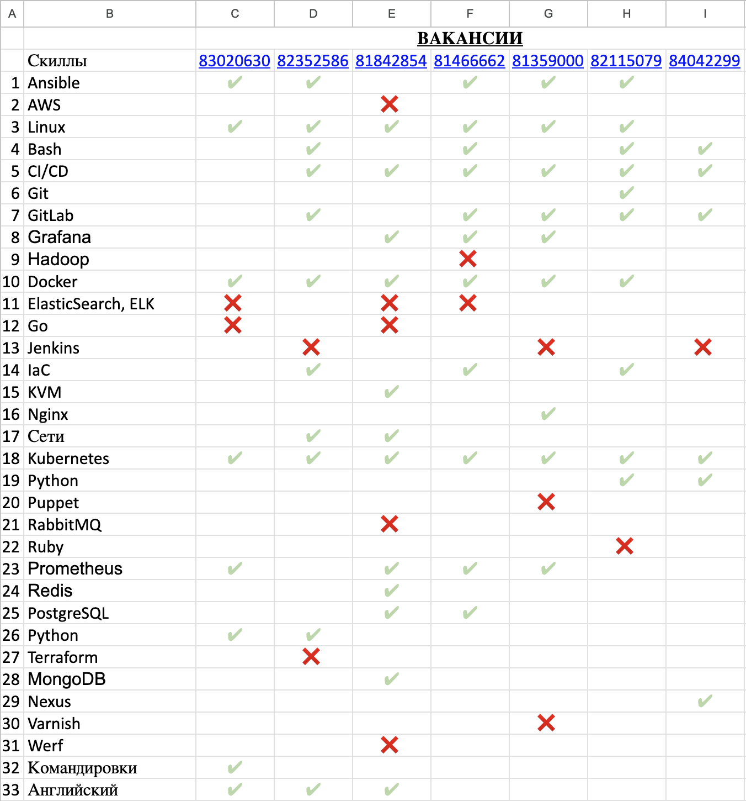
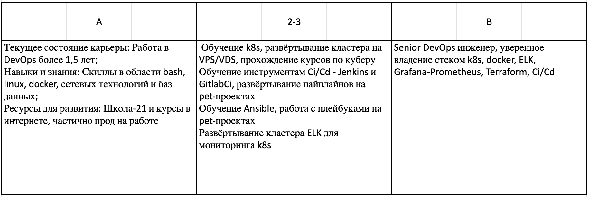

### Анализ вакансий

Семь вакансий на желаемую должность и требуемые знания:

### Выводы:

Наиболее важные скиллы - Kubernetes (уверенные знания требуются на всех вакансиях), Linux - 6 из 7, и Ci/Cd - 6 из 7.

Наиболее полные знания я имею по Linux - 10 лет опыта работы с Linux. С Ci/Cd и k8s я только начинаю работать (первый год), поэтому необходимо подтягивать эти знания. Способы:

- активное развитие на работе
- использование виртуальных машин
- обучение по видеороликам и курсам
- развёртывание VPS/VDS

Таким образом формируем по методике SMART таблицу развития на ближайшее будущее:

Шаги по достижению целей:

1. Пройти курс по k8s в minikube
2. Развернуть кластер через kubespray на VPS/VDS
3. Софт для кластера устанавливать через Ansible
4. Развернуть Ci/Cd для данного кластера
5. Развернуть мониторинг серверов на Grafana
6. Развернуть логи через ELK для кластера
